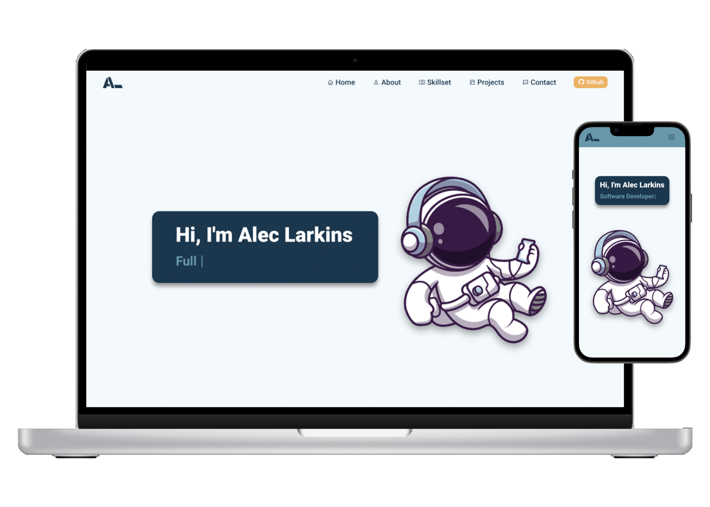

<h2 align="center">
  Personal Website<br/>
  <a href="http://aleclarkins.com/" target="_blank">aleclarkins.com</a>
</h2>
<p align="center">
  Built with <a href="https://reactjs.org/" target="_blank">ReactJS</a> and hosted with <a href="https://vercel.com/" target="_blank">Vercel</a>
</p>
<p align="center">
This is the first iteration of my personal website that I created to feature my skillset and projects. 
</p>
<div align="center">
  
</div>

## Features

**📱 Responsive**

**⚡️ Animations**

**✔️ Well Designed & Functional**

## Built with:

- ReactJS
- HTML5
- CSS3
- Javascript
- NodeJS
- Vercel

## 🛠 Installation & Set Up

1. Navigate to project directory and install all modules and dependencies

   ```sh
   npm install
   ```

2. Run app in developer mode

   ```sh
   npm start
   ```

3. Open [http://localhost:3000](http://localhost:3000) to view it in your browser.
